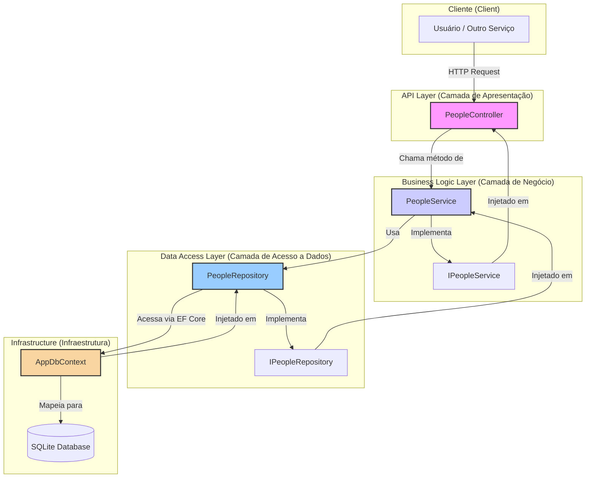

# docs/architecture-overview.md

# 🧭 Arquitetura & Padrões — Paschoalotto.People

Este documento descreve a arquitetura de referência do projeto, servindo como guia para desenvolvimento, evolução e manutenção.

---

## 0) Visão Geral

```

/src
├─ Paschoalotto.People.Domain
├─ Paschoalotto.People.Application
├─ Paschoalotto.People.Infrastructure
├─ Paschoalotto.People.CrossCutting
└─ Paschoalotto.People.Api
/tests
├─ Paschoalotto.People.UnitTests
└─ Paschoalotto.People.IntegrationTests
/docs
├─ implementation-guidelines.md
└─ architecture-overview\.md

````



“Por que criamos cada classe/camada” (rationale didático)

- **Idioma padrão no código**: Inglês (classes, métodos, propriedades).
- **Idioma nos logs**: Português, para facilitar auditoria e troubleshooting local.
- **Justificativa**: Inglês é universal para colaboração, bibliotecas e manutenção futura; português torna o suporte mais ágil para o time operacional.

---

## 1) Paschoalotto.People.Domain

- **Responsabilidade**: núcleo de negócio.  
- **Conteúdo**: entidades (`Person`, `Individual`, `LegalEntity`), value objects (`Cpf`, `Cnpj`, `EmailAddress`, `PhoneNumber`, `Address`) e invariantes.  
- **Padrões aplicados**:  
  - *Domain-Driven Design* (DDD tático).  
  - Entidades ricas, encapsulando regras.  
  - Value Objects para evitar uso de primitivos “soltos”.  

**Sem dependências externas.** Mantém pureza e testabilidade.

---

## 2) Paschoalotto.People.Application

- **Responsabilidade**: portas da aplicação.  
- **Conteúdo**: contratos de repositório (`IPersonReadRepository`, `IPersonWriteRepository`), `IUnitOfWork`, `IFileStorageService`, `ITokenService`.  
- **Decisão**: não introduzimos “application services” complexos nesta POC para não alongar o prazo. Controllers orquestram diretamente repositórios.  

Mantém a separação entre **o que** a aplicação precisa e **como** isso é entregue.

---

## 3) Paschoalotto.People.Infrastructure

- **Responsabilidade**: detalhes concretos.  
- **Conteúdo**:  
  - **EF Core** (SQLite na POC, Postgres em produção).  
  - Repositórios de leitura (com `AsNoTracking`) e escrita (com tracking).  
  - Implementação de `FileSystemStorageService` (salva arquivos em `_storage`).  
  - `JwtTokenService` para autenticação JWT.  
  - `NLogAuditLogger` para logs de auditoria.  
- **Justificativa**: todos os detalhes de frameworks ficam fora do domínio. Troca de provider não afeta regras de negócio.

---

## 4) Paschoalotto.People.CrossCutting

- **Responsabilidade**: registro de dependências e infraestrutura comum.  
- **Conteúdo**: `DependencyInjection` centralizando DI.  
- **Benefício**: reduz acoplamento entre projetos e garante consistência.

---

## 5) Paschoalotto.People.Api

- **Responsabilidade**: interface HTTP.  
- **Conteúdo**:  
  - Controllers (`AuthController`, `PeopleController`).  
  - Contratos de entrada/saída (DTOs).  
  - Configuração de Swagger, autenticação e middleware.  
- **Endpoints principais**:  
  - `POST /api/v1/auth/login` → autenticação JWT.  
  - `POST /api/v1/individuals` → cria PF.  
  - `POST /api/v1/legal-entities` → cria PJ.  
  - `POST /api/v1/individuals/{id}/photo` → upload foto.  
  - `POST /api/v1/legal-entities/{id}/logo` → upload logotipo.  
  - `GET /api/v1/people/{id}` → consulta pessoa.  
  - `GET /api/v1/people/search?name=...` → busca por nome.  
- **Autorização**: JWT + policies (`People.Read`, `People.Write`).  
- **Arquivos estáticos**: fotos/logos expostos via `/files`.

---

## 6) Padrões & Convenções

- **Inglês no código**, português nos logs.  
- **DTOs** com sufixos `Request` e `Response`.  
- **Erros de domínio** levantam exceções (`ArgumentException`).  
- **Controllers finos**: conversão de DTO → domínio, e domínio → DTO.  
- **Uploads separados** do create: simplifica Swagger, mantém responsabilidades claras.  

---

## 7) Auditoria

- Implementada com **NLog**.  
- Gera dois arquivos diários em `_logs/`:  
  - `app-YYYY-MM-DD.log` → log operacional.  
  - `audit-YYYY-MM-DD.json` → log de auditoria (estruturado).  
- Auditoria dispara nos eventos principais: criação e upload de documentos.  
- Informações capturadas: usuário, IP, ação, entidade, id, caminho do arquivo.

---

## 8) Testes

- **UnitTests**: focam no domínio (validadores de CPF/CNPJ, invariantes, métodos de entidade).  
- **IntegrationTests**: fluxo ponta a ponta (criação → upload → consulta).  
- **JWT**: os testes realizam login antes de acessar endpoints protegidos.  

---

## 9) Roadmap de Evolução

- Adição de auditoria com tabela `AuditLogs` no banco.  
- Substituir `FileSystemStorageService` por S3 ou Blob Storage.  
- Health checks e métricas.  
- Políticas de retry e resiliência.  

---

# 📄 `docs/implementation-guidelines.md`

# Diretrizes de Implementação — Paschoalotto.People

Este documento reúne instruções práticas para manter consistência na implementação.

---

## 1) Linguagem & Convenções

- **Código**: em inglês (padroniza com bibliotecas, facilita colaboração internacional).  
- **Logs**: em português (facilita suporte local).  
- **Nomes**: `PascalCase` para classes/propriedades, `camelCase` para variáveis locais.  
- **DTOs**: `Request` para entrada, `Response` para saída.  

---

## 2) Segurança

- **Autenticação**: JWT configurado em `appsettings.json` (`Jwt:Issuer`, `Jwt:Audience`, `Jwt:Key`).  
- **Autorização**: policies `People.Read` e `People.Write`.  
- **Boas práticas**: nunca versionar chaves reais; usar Secret Manager ou variáveis de ambiente em produção.  

---

## 3) Auditoria

- **NLog** como provider.  
- Arquivos gerados em `_logs/`.  
- Auditoria disparada após operações de negócio relevantes (`Create`, `UploadPhoto`, `UploadLogo`).  
- Informações auditadas: usuário, IP, ação, entidade, id, caminho.  
- Dados sensíveis (CPF, CNPJ) devem ser mascarados antes do log.  

---

## 4) Persistência

- **Provider**: EF Core com SQLite na POC.  
- **Migrations**: `dotnet ef migrations add <Name> --project Infrastructure --startup-project Api`.  
- **Banco em produção**: Postgres.  

---

## 5) Endpoints

- `POST /api/v1/auth/login`: login com usuário/senha fixos.  
- `POST /api/v1/individuals`: cria pessoa física.  
- `POST /api/v1/legal-entities`: cria pessoa jurídica.  
- `POST /api/v1/individuals/{id}/photo`: upload de foto.  
- `POST /api/v1/legal-entities/{id}/logo`: upload de logotipo.  
- `GET /api/v1/people/{id}`: consulta pessoa.  
- `GET /api/v1/people/search?name=...`: busca por nome.  

---

## 6) Testes

- **Unitários**: garantem regras de domínio.  
- **Integração**: validam fluxo completo com API real, banco SQLite e storage em disco.  
- **Estratégia**: antes de requests protegidos, testes fazem login e adicionam o token no header Authorization.  

---

## 7) Estrutura de Pastas

- `/src` → projetos principais.  
- `/tests` → testes unitários e de integração.  
- `/docs` → documentação.  

---

## 8) Práticas Recomendadas

- Tratar exceções de domínio e retornar `400 BadRequest`.  
- Retornar `500` apenas em falhas inesperadas.  
- Nunca expor detalhes internos em mensagens de erro.  
- Usar `ILogger<T>` em pontos críticos.  
- Revisar logs regularmente para identificar inconsistências.  

---

